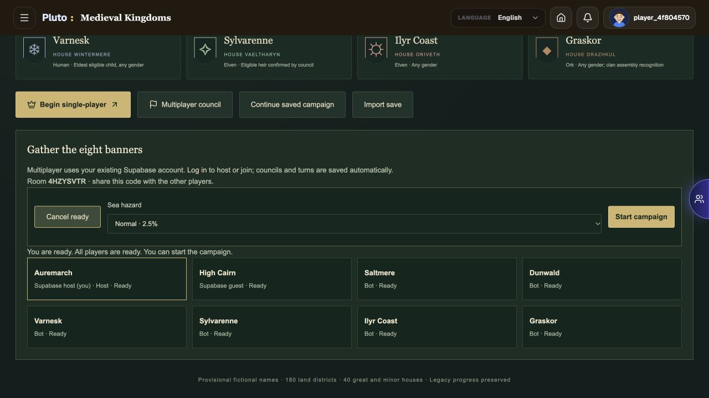
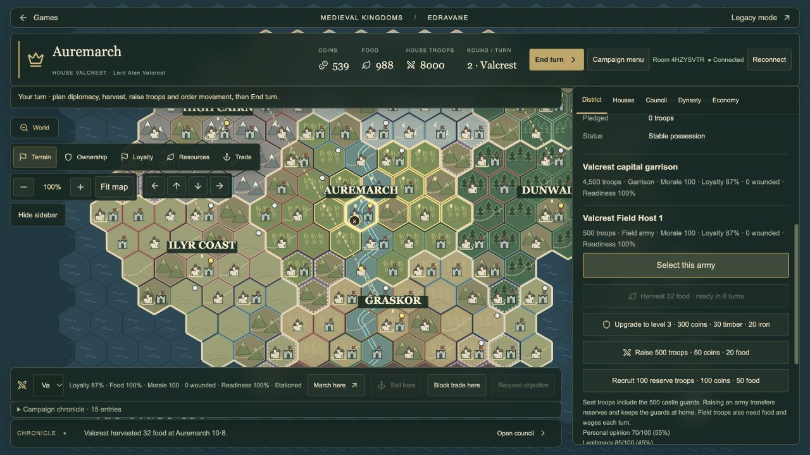

# Edravane multiplayer on Supabase

Edravane uses the application's existing Supabase project for account authentication, room storage, game authority and live notifications. A separate Edravane Node/WebSocket server is no longer required. Your normal frontend still needs its existing hosting. Supabase plan quotas and limits still apply.

## Playing

1. Sign in with your usual application account.
2. Open `/games/medieval-kingdoms`, choose a crown and click **Multiplayer council**.
3. **Host council**, then share its eight-character room code. Other signed-in players choose another crown and **Join council**.
4. Every human, including the host, clicks **Ready**. The host can then **Start campaign**. Empty seats are bots.
5. Use **End turn** to pass control. War, invasion, peace and marriage decisions still permit the receiving player to respond. Battle orders stay private until both sides commit and the round resolves.

Accepted actions save immediately. The same account can recover its seat by joining the same code; **Reconnect** uses the code remembered in the current browser tab. Save the code separately if you want to recover from another browser or device. Losing local tab storage does not delete the campaign.

A database heartbeat renews the caller's seat every 30 seconds. After a 90-second absence, another active player's synchronization marks that player disconnected, lets bots control the crown, and transfers host authority when necessary. Returning with the same account restores human control. Takeover is checked on requests rather than by an always-running worker. When everyone is offline, the campaign remains saved and waits for a seated player to return.

Single-player saves are unchanged. Existing rooms stored by the old Node authority are not automatically imported into Supabase. The old server source remains solely as a regression fixture; the frontend does not connect to it.

## Deployment

The following Edravane backend changes have already been deployed to the workspace's linked Supabase project:

- Migration `20261101000000_edravane_supabase_multiplayer.sql`.
- Edge Function `edravane-match`.

The frontend changes must be published through the application's usual hosting workflow for public players to receive them. This migration does not publish the website.

Use the application's normal `VITE_SUPABASE_URL` and `VITE_SUPABASE_PUBLISHABLE_KEY`. No Edravane socket URL, game-server host, port or persistence-directory variable is needed. Keep the service-role key exclusively in the Supabase function environment; never place it in a Vite variable.

For a different project, apply the Edravane migration and deploy the function. Review pending migrations before using `supabase db push`: this workspace has unrelated migrations, and the Edravane deployment applied only its own migration in a transaction with a migration-ledger entry. The function can be updated with:

```sh
supabase functions deploy edravane-match --use-api
```

`supabase/config.toml` disables the platform's legacy JWT verification for this function. The function itself calls `auth.getUser` for every bearer token and rejects missing or invalid sessions before accessing rooms. Do not remove that check. This supports the project's existing publishable-key setup without accepting anonymous game actions.

## Authority and privacy

The browser submits intentions to the Edge Function, which derives its house and host privileges from the authenticated room member and runs the shared campaign/battle reducers. Clients cannot upload a replacement campaign or choose another player's actor identity. Command sequence checks reject replays.

`edravane_rooms` contains the full authoritative campaign and has RLS enabled with browser access revoked. `edravane_members` lets a player read only their own membership; heartbeat renews only that authenticated player's existing active seat. `edravane_room_events` contains only the room code and revision number. Seated members can read those notices through RLS, and only this small table is published to Realtime.

A revision notification triggers a personalized Edge Function snapshot. The opponent's committed battle plans are removed from that response. Neither raw campaign data nor private orders are broadcast through Realtime. The 30-second heartbeat also checks revisions, so missed live updates can recover through a snapshot.

The service-only `edravane_store_room` SQL function atomically commits the room, membership status and revision notice. Its expected-version check prevents concurrent writers from overwriting each other. The Edge Function retries competing intents against the newly stored state. Ordinary player accounts cannot call this store function or directly modify room tables. Creating councils is limited to six per account per hour.

Bots use the same rules during verified requests. Human turns do not run on a wall-clock timer. No resident game loop or second hosted game process is needed.

## Verification

```sh
npm run check:edravane
npm run test:edravane
npm run build
```

All 98 Edravane tests pass. Nine Supabase tests cover authentication, host/member authority, readiness, competing writes, hidden battle orders, lease expiry, account recovery, all-offline pause and actual Postgres RLS/CAS behavior. Legacy socket tests remain regression coverage for the shared game rules.

Live checks against the deployed Supabase project used two disposable authenticated accounts and verified real Realtime notices, private-table denial, shared turn handoff, hidden human battle commitments, persisted wounds/results, host migration and account resume. Two isolated production-preview browser sessions verified host/join, both Ready controls, synchronized Start, shared turns and reload/reconnect. The old Edravane server was stopped throughout these checks. Temporary test rooms and accounts are cleaned up afterward.





Implementation references: [Supabase Edge Functions](https://supabase.com/docs/guides/functions), [database functions](https://supabase.com/docs/guides/database/functions), and [row-level security](https://supabase.com/docs/guides/database/postgres/row-level-security).
