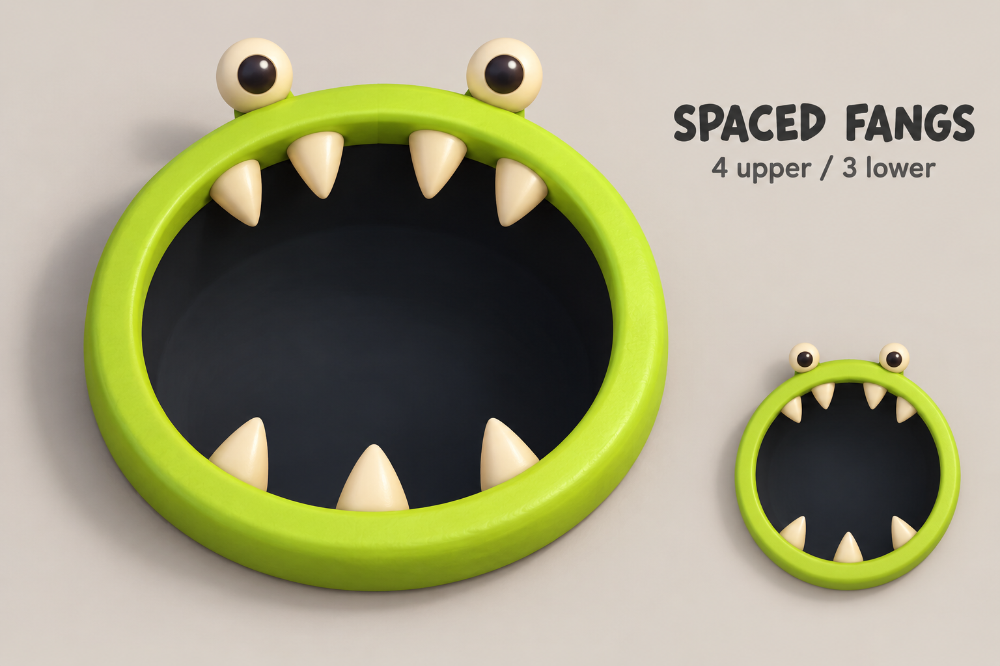
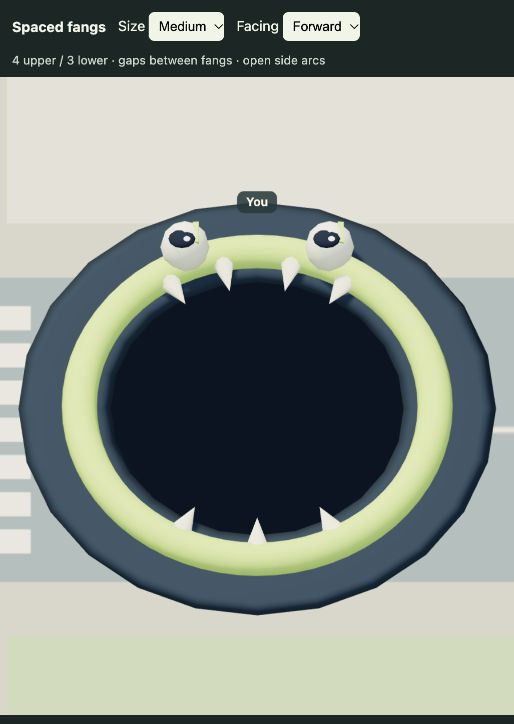

# Eat It: spaced fangs

Generated with the built-in imagegen tool before implementation.

Four upper fangs and three lower fangs follow the mouth's rear and front arcs. The upper pair leaves a wider center gap, both jaws have space between every tooth, and the side arcs stay bare. Cream tapered geometry attaches to the colored rim and points inward. The jaws rotate and grow with each human or bot monster.

## Initial teeth implementation

The current model adds a narrow dark outline and six randomly assigned eye expressions: angry, sad, bored, hungry, happy, and surprised. The screenshot above documents the first teeth implementation, before those eye variants.

Interactive local preview: `/tests/eat-it-teeth-preview.html`.

## Generation prompt

Use case: stylized-concept. Asset type: game character design idea sheet, not a production texture. Create a clean concept image of a friendly monster from a top-down 3D arcade game: the monster is ONLY a thick lime green circular mouth rim lying flat on the ground, surrounding a very dark open circular pit. Two small cream stalk eyes with dark pupils sit just outside the rear/top edge. No body, legs or arms. Primary request: redesign its teeth as two sparse rows, four cream tapered fangs along the TOP inner mouth edge pointing down toward the center, and three cream tapered fangs along the BOTTOM inner mouth edge pointing up toward the center. Leave generous dark gaps between every tooth, a slightly wider center gap in the top row, and NO teeth on the left or right side arcs. Seven teeth total. Tips do not meet, most of the mouth remains open. Soft rounded low-poly geometry, warm ivory enamel, short chunky fangs, lime rim, dark slate pit. Main large view centered, nearly overhead with a gentle 3D camera tilt, oriented eyes at top; one small overhead detail of the same exact mouth at lower right showing tooth spacing. Neutral pale warm gray background. Small typography heading 'SPACED FANGS' and subtitle '4 upper / 3 lower'. Avoid continuous sawtooth ring, excessive teeth, humanoid monster, gums, tongue, scary horror, crowded composition. Preserve the simple circular hole-monster identity.
